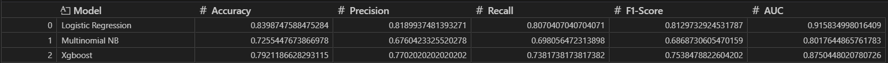
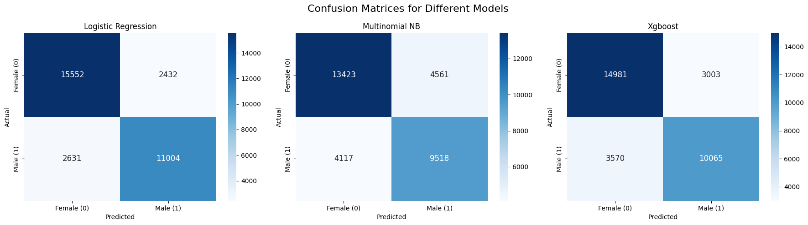
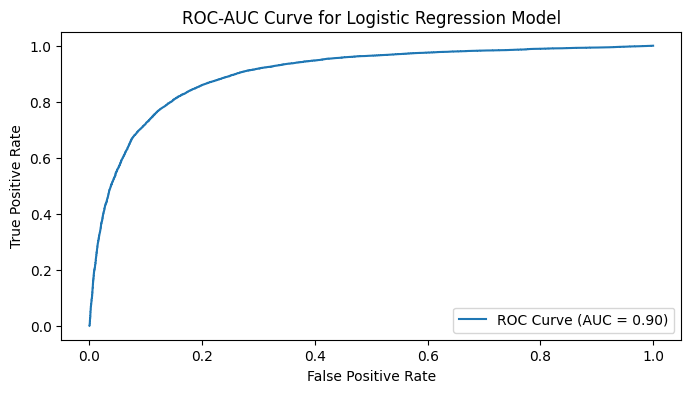

# Gender Prediction

## Description
This project implements a gender prediction model using various machine learning algorithms, including Logistic Regression, Multinomial Naive Bayes, and XGBoost. The model predicts gender based on names.

## Installation Instructions
1. Clone the repository.
2. Install the required libraries:
   ```bash
   pip install pandas scikit-learn xgboost joblib matplotlib seaborn
   ```

## Usage
1. Open the Jupyter notebook `gender prediction.ipynb`.
2. Run the cells sequentially to load the data, preprocess it, build the models, and evaluate their performance.

## Model Evaluation
The following models are implemented:
- Logistic Regression
- Multinomial Naive Bayes
- XGBoost

Performance metrics such as accuracy, precision, recall, F1-score, and AUC are calculated for each model.

### Accuracy Metrics


### Confusion Matrices


### ROC - AUC Curve


## Deployment
The trained model is saved as `gender_predictor_pipeline.pkl` for future use.

## License
This project is licensed under the [MIT License](LICENSE).
